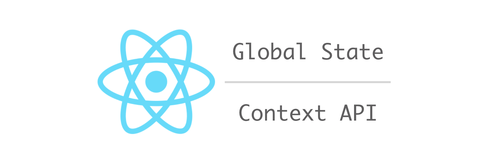

  

# Microfront 1

Esse microfront foi desenvolvido em **react native** utilizando **Context API** como máquina de estado.

## Dependência

Esse microfront utiliza o [microfront 2](https://github.com/rondinellimorais/micro-front-end/microfront2) megeando as rotas.

- Stack.Navigator
  - RondPage (`Screen`)
  - Page1 (`Screen`)
  - Microfront2Main (`Navigator like as Screen`)
    + ArtistPage (`Screen`)
    + DetailsArtistPage (`Screen`)